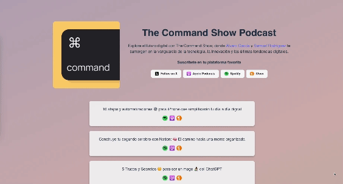
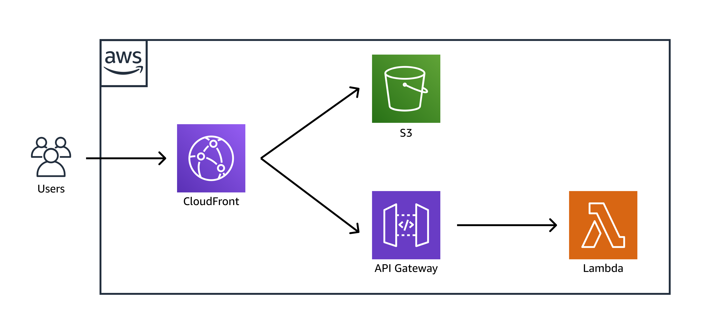
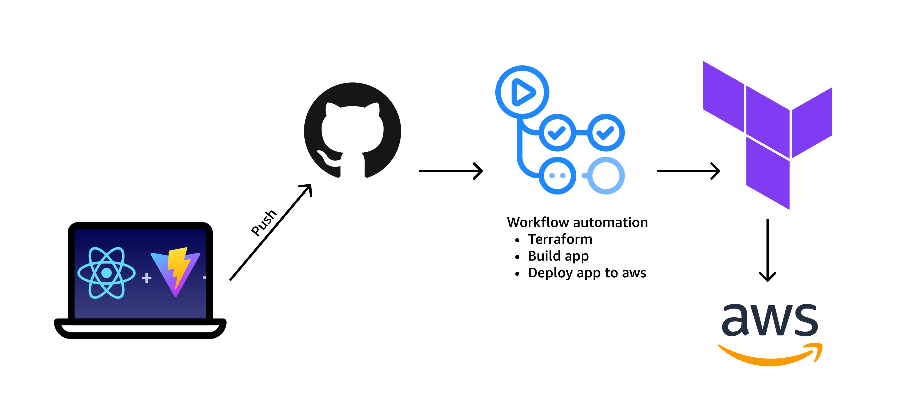

# Command Show Website

## Description

The Command Show is a podcast covering tech & innovation news in the industry in spanish. I've developed this website to test some cloud & dev skills and to offer this project a place where users can find the most recent episodes. 

## Architecture
This project runs under thee AWS architecture using terraform to deploy it. The React app is deployed to an S3 Bucket which uses CloudFront to distribute it. A lambda function was developed in Python to obtain the latest 5 episodes of the podcast to be shown on the app using axios. The API Gateway allows the connection and usage of the lambda function.

## CI / CD
In order to speed up the deployment and testing of the app I've implemented a workflow to automate this process so that every time my github repo recieves a push to the master branch the following happens:
1. AWS Credentials are configured
2. Terraform is configured and initialized
3. Terrafom validation and format.
4. Terrafom Plan & Apply
5. Build React application
6. Deploy react app to S3 bucket.

## Features
* Native Dark Mode support
* Responsive
* Updates episodes automatically
* Animated background

## Usage
To check our page simply access our [website](https://www.commandshow.lvrpiz.com).

## Contact
If you have any questions or comments about this project, feel free to contact me at email.